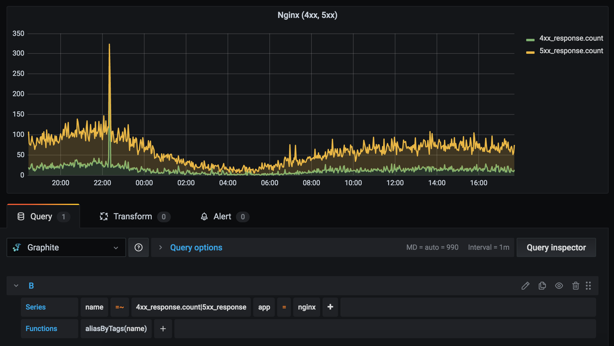

[](https://opensource.org/licenses/MIT)

## Overview
Python exporter to query Elasticsearch data (log count) and send it to Graphite

## Example output
```
level_warn.count;source=ES;type=logs;team=devops;app=web-01 237 1614777480
level_warn.count;source=ES;type=logs;team=devops;app=web-01 245 1614777540

level_error.count;source=ES;type=logs;team=devops;app=web-01 18 1614777480
level_error.count;source=ES;type=logs;team=devops;app=web-01 22 1614777540

200_response.count;source=ES;type=logs;team=devops;app=nginx 31130 1614777480
200_response.count;source=ES;type=logs;team=devops;app=nginx 30428 1614777540

4xx_response.count;source=ES;type=logs;team=devops;app=nginx 5 1614777480
4xx_response.count;source=ES;type=logs;team=devops;app=nginx 7 1614777540

5xx_response.count;source=ES;type=logs;team=devops;app=nginx 33 1614777480
5xx_response.count;source=ES;type=logs;team=devops;app=nginx 39 1614777540

Metrics sent for: 5 queries
```

## Grafana Graph (Graphite)


## Dependencies
- Python v3.6
- Elasticsearch endpoint should be accessible
- Graphite v1.1.x or higher (if you want to use tagged series)
- Carbon should be accessible on plaintext port

## Configuration
This exporter can be run as a cronjob to fetch Elasticsearch data on a regular interval

## License
Code released under the [MIT License](https://opensource.org/licenses/MIT)